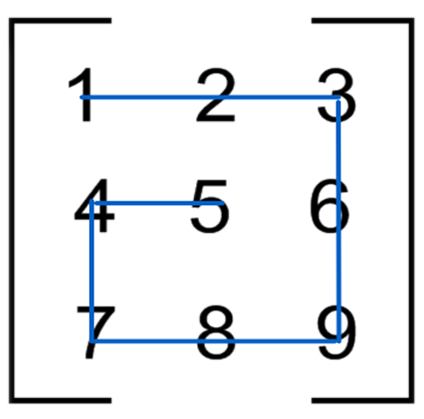
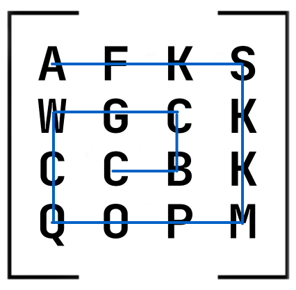

Python: Списки
=====================================

.. contents::

01 - Вес Хэмминга (hamming_weight.py)
-------------------------------------

Вес Хэмминга это количество единиц в двоичном представлении числа.
Реализуйте функцию hamming_weight, которая считает вес Хэмминга.

Примеры:

    >>> hamming_weight(0)
    0
    >>> hamming_weight(4)
    1
    >>> hamming_weight(101)
    4

02 - Треугольник Паскаля (triangle.py)
--------------------------------------

Треугольник Паскаля — бесконечная таблица биномиальных коэффициентов, имеющая треугольную форму. В этом треугольнике на вершине и по бокам стоят единицы. Каждое число равно сумме двух расположенных над ним чисел. Строки треугольника симметричны относительно вертикальной оси::

    0:      1
    1:     1 1
    2:    1 2 1
    3:   1 3 3 1
    4:  1 4 6 4 1

Напишите функцию triangle(), которая возвращает указанную строку треугольника Паскаля в виде списка.

Пример::

    >>> triangle(0)
    [1]
    >>> triangle(4)
    [1, 4, 6, 4, 1]

03 - Увеличение двумерного списка (enlarge.py)
----------------------------------------------

Реализуйте функцию enlarge(), которая принимает изображение в виде двумерного списка строк и увеличивает его в два раза, то есть удваивает каждый символ по горизонтали и вертикали.

    >>> def show(image):
    ...     for line in image:
    ...         print(line)
    ...
    >>> dot = ['@']
    >>> show(enlarge(dot))
    @@
    @@
    >>> frame = [
    ...     '****',
    ...     '*  *',
    ...     '*  *',
    ...     '****'
    ... ]
    >>> show(frame)
    ****
    *  *
    *  *
    ****
    >>> show(enlarge(frame))
    ********
    ********
    **    **
    **    **
    **    **
    **    **
    ********
    ********

| Подсказка
Если вам потребуется склеить список строк в одну строку, воспользуйтесь таким методом:

    >>> chunks = ["Hello", " ", "World", "!"]
    >>> ''.join(chunks)
    'Hello World!'

04 - Длина последнего слова (length_of_last_word.py)
------------------------------

Реализуйте функцию length_of_last_word(), которая возвращает длину последнего слова переданной на вход строки. Словом считается любая последовательность не содержащая пробелы, символы перевода строки \n и табуляции \t.

    >>> length_of_last_word('')
    0
    >>> length_of_last_word('man in Black')
    5
    >>> length_of_last_word('hello, world!     ')
    6
    >>> length_of_last_word('hello\t\nworld')
    5

05 - Чанкование (chunked.py)
----------------------------

Реализуйте функцию chunked, которая принимает на вход число и последовательность. Число задает размер чанка (куска). Функция должна вернуть список, состоящий из чанков указанной размерности. При этом список должен делиться на куски-списки, строка — на строки, кортеж — на кортежи!

    >>> chunked(2, ['a', 'b', 'c', 'd'])
    [['a', 'b'], ['c', 'd']]
    >>> chunked(3, ['a', 'b', 'c', 'd'])
    [['a', 'b', 'c'], ['d']]
    >>> chunked(3, 'foobar')
    ['foo', 'bar']
    >>> chunked(10, (42,))
    [(42,)]

06 - Возрастающая последовательность (is_continuous_sequence.py)
----------------------------------------------------------------

Реализуйте функцию is_continuous_sequence(), которая проверяет, является ли переданная последовательность целых чисел возрастающей непрерывно (не имеющей пропусков чисел). Например, последовательность [4, 5, 6, 7] — непрерывная, а [0, 1, 3] — нет. Последовательность может начинаться с любого числа. Главное условие — отсутствие пропусков чисел. Последовательность из одного числа не может считаться возрастающей.

    >>> is_continuous_sequence([10, 11, 12, 13])
    True
    >>> is_continuous_sequence([-5, -4, -3])
    True
    >>> is_continuous_sequence([10, 11, 12, 14, 15])
    False
    >>> is_continuous_sequence([1, 2, 2, 3])
    False
    >>> is_continuous_sequence([7])
    False
    >>> is_continuous_sequence([])
    False

07 - Самая длинная подстрока (find_longest_length.py)
-----------------------------------------------------

Реализуйте функцию find_longest_length(), принимающую на вход строку и возвращающую длину максимальной последовательности из неповторяющихся символов. Подстрока может состоять из одного символа. Например в строке qweqrty, можно выделить следующие подстроки: qwe, weqrty. Самой длинной будет weqrty, а её длина — 6 символов.

    >>> find_longest_length('abcdeef')
    5
    >>> find_longest_length('jabjcdel')
    7

08 - Сравнение версий (compare_version.py)
------------------------------------------

Реализуйте функцию compare_version(), которая сравнивает переданные версии version1 и version2. Если version1 > version2, то функция должна вернуть 1, если version1 < version2, то -1, если же version1 = version2 — 0.

Версия — это строка, в которой два числа (мажорная и минорные версии) разделены точкой, например: 12.11. Важно понимать, что версия — это не число с плавающей точкой, а несколько чисел не связанных между собой. Проверка на больше/меньше производится сравнением каждого числа независимо. Поэтому версия 0.12 больше версии 0.2.

Пример порядка версий::

    0.1 < 1.1 < 1.2 < 1.11 < 13.37
    >>> compare_version("0.1", "0.2")
    -1
    >>> compare_version("0.2", "0.1")
    1
    >>> compare_version("4.2", "4.2")
    0

Подробнее о версиях: http://semver.org/lang/ru/

| Подсказка
Разобрать строку на части, разделённые некоторой подстрокой, можно так:

    >>> 'foo::bar::baz'.split('::')
    ['foo', 'bar', 'baz']

09 - Список диапазонов (summary_ranges.py)
------------------------------------------

Реализуйте функцию summary_ranges(), которая находит в списке непрерывные возрастающие последовательности чисел и возвращает список с их перечислением.

    >>> summary_ranges([])
    []
    >>> summary_ranges([1])
    []
    >>> summary_ranges([1, 2, 3])
    ['1->3']
    >>> summary_ranges([0, 1, 2, 4, 5, 7])
    ['0->2', '4->5']
    >>> summary_ranges([110, 111, 112, 111, -5, -4, -2, -3, -4, -5])
    ['110->112', '-5->-4']

10 - Транспонирование матриц (transposed.py)
--------------------------------------------

Транспонированием матрицы называется операция, при которой столбцы матрицы становятся строками, а строки становятся столбцами. Представим некую двумерную матрицу::

    1 2 3
    4 5 6
    7 8 9

После транспонирования матрица будет выглядеть так::

    1 4 7
    2 5 8
    3 6 9

Транспонирование производилось по главной диагонали, то есть 1, 5 и 9 остались на своих местах, а сама матрица оказалась как бы повёрнута на 180 градусов относительно этой воображаемой диагональной оси.

Реализуйте функцию transposed(), которая должна принимать матрицу в виде списка списков и возвращать транспонированную матрицу (новый список списков).

Имейте в виду, что хоть в математике и транспонируют строго квадратные матрицы, ваша функция transposed() должна быть более "всеядной": она должна уметь переворачивать и прямоугольные матрицы!

    >>> transposed([[1]])
    [[1]]
    >>> transposed([[1, 2], [3, 4]])
    [[1, 3], [2, 4]]
    >>> transposed([[1, 2], [3, 4], [5, 6]])
    [[1, 3, 5], [2, 4, 6]]
    >>> transposed(transposed([[1, 2]])) == [[1, 2]]
    True

11 - Чанкование потока (ichunks.py)
-----------------------------------

В испытании "Чанкование" вам нужно было реализовать функцию, которая "нарезает" входную последовательность (любой iterable) на куски заданной длины. В этом же испытании вам нужно будет проделать нечто подобное, но уже с итератором — потенциально бесконечным! Иначе говоря, вам предстоит обрабатывать поток данных. Примерами таких потоков могут быть читаемый с диска файл очень большого размера или данные видео-трансляции, передаваемые по сети. В обоих случаях вы не можете себе позволить получить все данные сразу в виде структуры в памяти — вам её просто не хватит. И поэтому же вы не можете накапливать список кусочков внутри вашей функции, вам нужно возвращать поток кусочков.

Реализуйте функцию ichunks(), которая должна принимать в качестве аргументов размер кусочка (положительное целое число) и источник данных (итератор). Вернуть функция должна итератор списков заданной длины, содержащих элементы из источника данных.

Внимание, в этот раз вам нужно будет формировать куски строго заданной длины! Если для последнего куска (если поток вообще закончится) не хватит элементов, то весь кусок отбрасывается!

Примеры применения функции:

    >>> list(ichunks(2, [1, 2, 3, 4, 5]))
    [[1, 2], [3, 4]]
    >>> # ^ пятёрка была отброшена
    >>>
    >>> import itertools
    >>> # itertools.count() - бесконечный поток чисел 1, 2, 3...
    >>> list(itertools.islice(itertools.count(), 10000, 10005))
    [10000, 10001, 10002, 10003, 10004]
    >>>
    >>> stream = ichunks(3, itertools.count())  # поток троек чисел
    >>> list(itertools.islice(stream, 10000, 10002))
    [[30000, 30001, 30002], [30003, 30004, 30005]]

Возможно, вы отметили, что имя функции начинается с "i" и отрезает то, что будет содержать возвращаемый итератор. Такое имя выбрано неспроста: похожим образом нередко именуют функции, работающие с итераторами. Например, несколько функций из стандартного модуля itertools названы в этом стиле.

У нас, увы, нет возможности проверить код на переполнение памяти. Поэтому мы полагаемся на вашу ответственность. Если вы вернёте что-то вроде iter(huge_list), тесты будут пройдены, но такое решение не будет по-настоящему правильным!

| Подсказка
Чтобы вернуть итератор, воспользуйтесь при решении функциями, которые уже возвращают итераторы: map, zip, функции из модуля itertools.

12 - Зеркалирование матрицы (mirror_matrix.py)
----------------------------------------------

Реализуйте функцию mirror_matrix(), которая принимает двумерный список (матрицу) и изменяет его (по месту) таким образом, что правая половина матрицы становится зеркальной копией левой половины, симметричной относительно вертикальной оси матрицы. Если ширина матрицы — нечётная, то "средний" столбец не должен быть затронут.

    >>> from solution import mirror_matrix
    >>> l = [
    ...     [1, 2, 3],
    ...     [4, 5, 6],
    ... ]
    ...
    >>> mirror_matrix(l)
    >>> l == [
    ...     [1, 2, 1],
    ...     [4, 5, 4],
    ... ]
    ...
    True
    >>> l = [
    ...     [11, 12, 13, 14, 15, 16],
    ...     [21, 22, 23, 24, 25, 26],
    ...     [31, 32, 33, 34, 35, 36],
    ...     [41, 42, 43, 44, 45, 46],
    ...     [51, 52, 53, 54, 55, 56],
    ...     [61, 62, 63, 64, 65, 66],
    ... ]
    ...
    >>> mirror_matrix(l)
    >>> l == [
    ...     [11, 12, 13, 13, 12, 11],
    ...     [21, 22, 23, 23, 22, 21],
    ...     [31, 32, 33, 33, 32, 31],
    ...     [41, 42, 43, 43, 42, 41],
    ...     [51, 52, 53, 53, 52, 51],
    ...     [61, 62, 63, 63, 62, 61],
    ... ]
    ...
    True
    >>>

13 - Сумма интервалов (sum_of_intervals.py)
-------------------------------------------

Реализуйте функцию sum_of_intervals(), которая принимает на вход список интервалов и возвращает сумму всех длин интервалов. В данной задаче используются только интервалы целых чисел от 1 до ∞ , которые представлены в виде списков. Первое значение интервала всегда будет меньше, чем второе значение. Например, длина интервала [1, 5] равна 4, а длина интервала [5, 5] равна 0. Пересекающиеся интервалы должны учитываться только один раз.

    >>> from solution import sum_of_intervals
    >>> sum_of_intervals([
    ... [1, 1],
    ... ])
    0
    >>> sum_of_intervals([
    ... [1, 2],
    ... [50, 100],
    ... [60, 70],
    ... ])
    51
    >>> sum_of_intervals([
    ... [1, 2],
    ... [5, 10],
    ... ])
    6
    >>>

14 - Обратная польская запись (rpn_calc.py)
-------------------------------------------

В данном упражнении необходимо реализовать стековую машину, то есть алгоритм, проводящий вычисления по обратной польской записи.

Обратная польская нотация или постфиксная нотация — форма записи математических и логических выражений, в которой операнды расположены перед знаками операций. Выражение читается слева направо. Когда в выражении встречается знак операции, выполняется соответствующая операция над двумя ближайшими операндами, находящимися слева от знака операции. Результат операции заменяет в выражении последовательность её операндов и знак, после чего выражение вычисляется дальше по тому же правилу. Таким образом, результатом вычисления всего выражения становится результат последней вычисленной операции.

Например, выражение (1 + 2) * 4 + 3 в постфиксной нотации будет выглядеть так: 1 2 + 4 * 3 +, а результат вычисления: 15. Другой пример - выражение: 7 - 2 * 3, в постфиксной нотации: 7 2 3 * -, результат: 1.

Реализуйте функцию rpn_calc, которая принимает список, каждый элемент которого содержит число или знак операции (+, -, *, /). Функция должна вернуть результат вычисления по обратной польской записи.

Примеры:

    >>> rpn_calc([1, 2, '+', 4, '*', 3, '+'])
    15
    >>> rpn_calc([7, 2, 3, '*', '-'])
    1
    >>>

15 - Улитка (snail_path.py)
---------------------------

Матрицу можно представить в виде двумерного списка. Например, список [[1, 2, 3, 4], [5, 6, 7, 8]] — это отображение матрицы::

    1 2 3 4
    5 6 7 8

Реализуйте функцию snail_path(), которая принимает на вход матрицу и возвращает список элементов матрицы по порядку следования от левого верхнего элемента по часовой стрелке к внутреннему. Движение по матрице напоминает улитку:

    >>> from solution import snail_path
    >>> snail_path([[1, 2], [3, 4]])
    [1, 2, 4, 3]
    >>> snail_path([[1, 2, 3], [8, 9, 4], [7, 6, 5]])
    [1, 2, 3, 4, 5, 6, 7, 8, 9]
    >>> snail_path([['b', 'c', 'a'], ['3', True, 11], [None, 'foo', 0]])
    ['b', 'c', 'a', 11, 0, 'foo', None, '3', True]
    >>>

16 - Умножение матриц
------------------------

17 - Копилка
---------------
